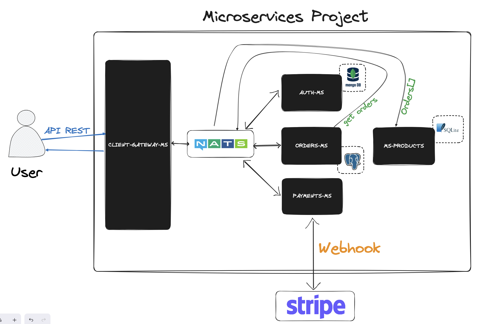
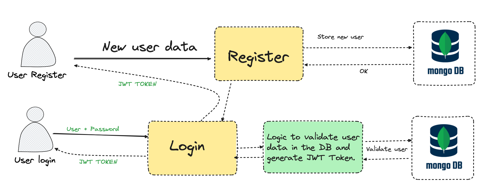
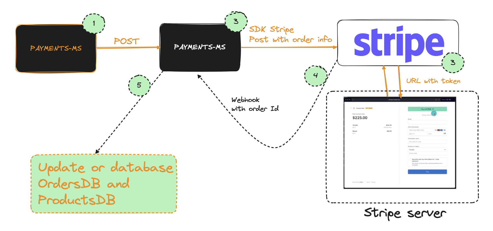
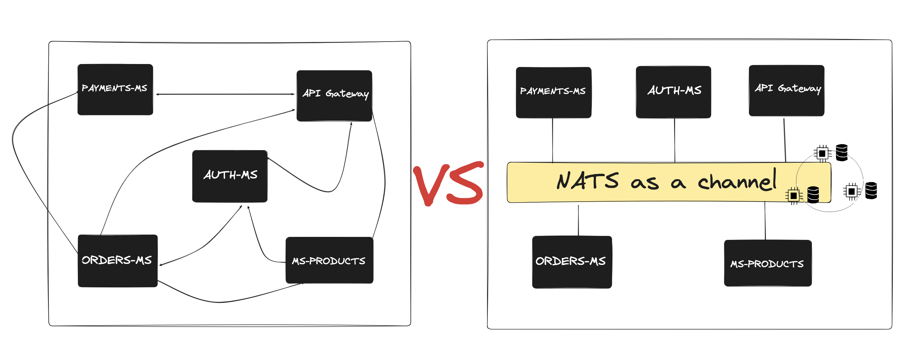
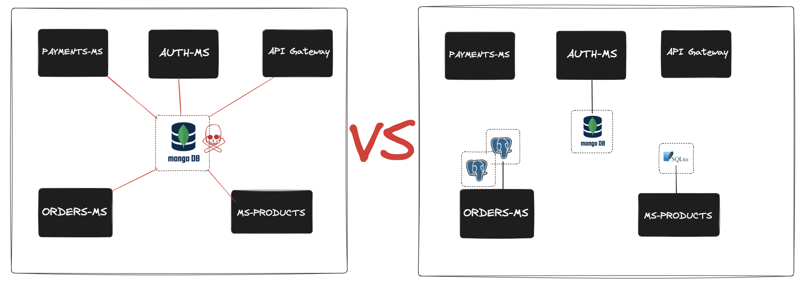
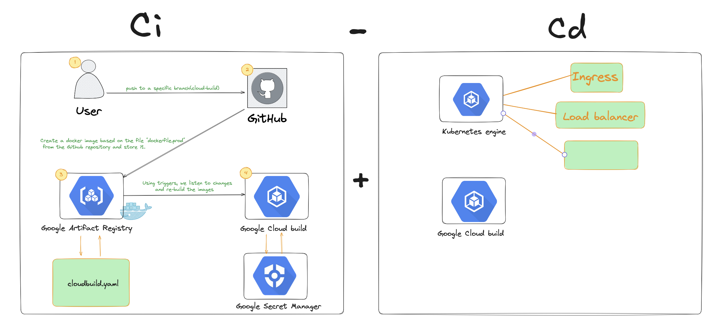

# Nestjs microservices project


- [Nestjs microservices project](#nestjs-microservices-project)
  - [Overview](#overview)
  - [Event pattern](#event-pattern)
  - [Database per service pattern](#database-per-service-pattern)
  - [CI-CD](#ci-cd)
  - [Installation](#installation)
    - [Dev](#dev)
    - [Steps to create Git Submodules](#steps-to-create-git-submodules)


This project is about everything learned in the Nestjs microservices course @Fernando-Herrera.
Next we will detail everything we learned, the miscroservices we have, how they communicate with each other, payments, ci-cd ...

## Overview 


The project is a **real ecommerce store application**, complete where we implement all the microservices patterns and clean code.

As we can see, the flow starts with the user interacting with our application, and as a good practice, the application has a single entry point which is API client `API Gateway`.
    
    - `The "Gateway" microservice is in charge of receiving the client requests and distributing them among the other corresponding microservices.

    - `Auth-ms` is in charge of generating JWT tokens for authenticate users, using Guard and custom decorators.
       In order to access the other microservices, the token must be included in the HTTP request, so the Auth microservice must have been called beforehand.

    
    - `Payments-ms`: After the user invokes the orders method (Orders-ms), it calls the payment microservice which finally invokes Stripe using its SDK. 
      When the user has paid, Stripe invokes our Webhook method to update our database (Stock).  


    - `Orders-ms`: The Orders microservice is in charge of storing all orders from our users, communicating and validating the data with the Products microservice.
  
    - `Products-ms`: The Products microservice allows us to create new products to sell in our store, as well as to retrieve available products, modify or delete products.


## Event pattern



When working with microservices, communication between multiple components (microservices) becomes a complicated task. As a solution, we use the NATS event pattern, so there is no strong binding between components and they can be scaled separately.

## Database per service pattern


If all our microservices use the same database, in the long run, we may have problems:
    - If one microservice needs to scale its database, we will have to do it for all of them.
    - If the database fails, the other microservices will not work.
    - If a microservice needs a database that adapts to it, it will not be able to, since it is the same for all of them.
   
As a solution, each microservice uses its own database, so we can work in a more flexible and scalable way.

## CI-CD



When it comes to uploading all our work to the servers it is a time-consuming task, since with a small change, we have to do all these steps:
    - We have to upload the code to a remote repository (Github).
    - Re-generate Docker images
    - Store these images.
    - Upload the code back to the server and all the configuration that goes with it.

With CI-CD, we automate all these steps, so that with a push to a branch, everything is done by itself.
In the attached figure, we can see how the pipeline is assembled and the components that make it up.

## Installation

### Dev
1. Clone the repo
2. Create .env file like .env.template
3. Execute command: `docker compose up --build`


### Steps to create Git Submodules

1. Creating a new repository on GitHub
2. Clone the repository on the local machine
3. Add the submodule, where `repository_url` is the url of the repository and `directory_name` is the name of the folder where you want the submodule to be stored (it must not exist in the project).
   


Añadir los cambios al repositorio (git add, git commit, git push)
```bash
git submodule add <repository_url> <directory_name>
git add .
git commit -m "Add submodule"
git push
```

Initialize and update Sub-modules, when someone clones the repository for the first time, he/she should execute the following command to initialize and update the sub-modules

```bash
git submodule update --init --recursive
```

To update the sub-module references
```bash
git submodule update --remote
```


```txt
If working in the repository that has the sub-modules, **first update and push** the sub-module and **then** the main repository. 

If you do it the other way around, you will lose references to the sub-modules in the main repository and you will have to resolve conflicts.
```
